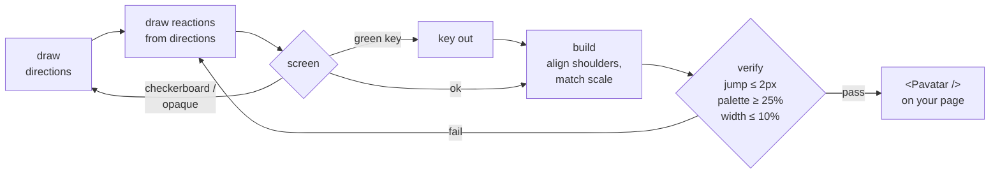

<div align="center">


# pretty-avatar

**Avatars that look back.**<br>
A tiny React component that turns its head to follow the cursor and reacts when poked —<br>
plus an agent skill, `/pretty-avatar`, that draws new characters for you.

[](https://www.npmjs.com/package/pretty-avatar)
[](https://github.com/kimookpong/pretty-avatar/actions/workflows/ci.yml)
[](https://www.npmjs.com/package/pretty-avatar)
[](LICENSE)

[**Live demo**](https://kimookpong.github.io/pretty-avatar/) · [Quick start](#quick-start) · [Characters](#characters) · [Props](#props) · [Draw your own](#draw-your-own) · [ภาษาไทย](https://github.com/kimookpong/pretty-avatar/blob/main/docs/README.th.md)

</div>

---

## Quick start

**1 — Add the package**

```bash
npm i pretty-avatar
```

**2 — Put two sheets in `public/avatars`**

On the [demo page](https://kimookpong.github.io/pretty-avatar/#cast), press **Try it** on a
character, then **Download** in the playground. Or [draw your own](#draw-your-own).

```
public/avatars/mochi-directions.webp
public/avatars/mochi-reactions.webp
```

<details>
<summary>Or fetch them from the terminal</summary>

```bash
mkdir -p public/avatars
curl -fsSL -o public/avatars/mochi-directions.webp https://kimookpong.github.io/pretty-avatar/avatars/mochi-directions.webp
curl -fsSL -o public/avatars/mochi-reactions.webp  https://kimookpong.github.io/pretty-avatar/avatars/mochi-reactions.webp
```

On SvelteKit the folder is `static/avatars`.

</details>

**3 — Render it**

```tsx
import { Pavatar } from 'pretty-avatar'

export function Header() {
  return <Pavatar name="mochi" />
}
```

That's it. It works in Vite, Next.js (App Router included — it ships `'use client'`), Remix,
Astro islands and anything else that renders React 18+.

## Characters

67 ready-made characters. Swap `mochi` for any name below, in both the file names and `name="…"`.

| | names |
| --- | --- |
| **originals** | `mochi` cat · `kuma` bear · `usagi` bunny · `kaeru` frog · `pan` panda · `piyo` chick |
| **animals** | `animal-bear` `animal-cat` `animal-chick` `animal-cow` `animal-deer` `animal-dog` `animal-duck` `animal-elephant` `animal-fox` `animal-frog` `animal-giraffe` `animal-hamster` `animal-hedgehog` `animal-hippo` `animal-koala` `animal-lion` `animal-mouse` `animal-otter` `animal-owl` `animal-panda` `animal-penguin` `animal-pug` `animal-rabbit` `animal-raccoon` `animal-red-panda` `animal-seal` `animal-sheep` `animal-sloth` `animal-squirrel` `animal-tiger` |
| **people** | `human-afro` `human-artist` `human-astronaut` `human-bald` `human-beanie` `human-bearded` `human-black-glasses` `human-blond` `human-bob` `human-builder` `human-bun` `human-cap` `human-chef` `human-curly-glasses` `human-doctor` `human-freckles` `human-grandfather` `human-grandmother` `human-headscarf` `human-hijab` `human-hoodie` `human-locs` `human-nurse` `human-pilot` `human-pixie` `human-ponytail` `human-silver-bob` `human-student` `human-turban` `human-wizard` |
| **and** | `person-robot` |

Every sheet is at `https://kimookpong.github.io/pretty-avatar/avatars/<name>-directions.webp`
and `<name>-reactions.webp`, about 180 KB each.

## Two ways to get a character

| | **Ready-made** | **Drawn for you** |
| --- | --- | --- |
| what | any of the 67 [above](#characters) | anything you describe, or you from a photo |
| how | download two `.webp` files | ask your agent `/pretty-avatar a chibi shiba with a red scarf` |
| needs | nothing | an agent, plus its image tool or an `OPENAI_API_KEY` |
| time | seconds | a few minutes, retries included |

## Props

```tsx
<Pavatar
  name="mochi"            // or directions="…" reactions="…"
  basePath="/avatars"     // where name looks for the sheets
  size={140}              // px, square
  label="avatar"          // what a screen reader calls it
  tracking                // follow the pointer
  deadZone={70}           // px around the centre where it looks straight ahead
  interactive             // react to clicks; false renders a plain image
  sleepAfter={20000}      // ms of stillness before it dozes off, 0 = never
  onBoop={(reaction) => {}}
/>
```

Every prop is optional except the sheets: give `name`, or both `directions` and
`reactions` (paths or imported images). TypeScript rejects anything in between.

Sheets somewhere else? `basePath="/static/avatars"`, or point at them directly:

```tsx
<Pavatar directions="/img/me-directions.webp" reactions="/img/me-reactions.webp" />
```

### What it does when poked

| you… | it… |
| --- | --- |
| click | blinks, then shows `heart` → `sparkle` → `starstruck` → `grin` → `bashful` in turn |
| click four times fast | gets `dizzy` |
| leave it alone | falls asleep (`sleepy`), wakes when the pointer moves |
| use a touch screen | stays still and reacts to taps |
| prefer reduced motion | skips the squash-and-stretch |

## Draw your own

Install the skill into every coding agent on your machine at once:

```bash
npx skills add kimookpong/pretty-avatar --skill pretty-avatar --agent '*' --global --yes
```

> The [skills](https://github.com/vercel-labs/skills) CLI knows ~80 agents — Claude Code,
> Codex, Windsurf, Cline, Roo Code, Kiro, Qwen Code, Goose, Amp, Continue and the rest.
> Use `--agent claude-code codex` to pick, or drop `--global` to install into one project.

Then ask:

```
/pretty-avatar put mochi on my homepage
/pretty-avatar a chibi shiba with orange fur and a red scarf
/pretty-avatar make one that looks like me        📎 photo.jpg
/pretty-avatar a brown owl, in the pastel style
```

Agents with their own image tool use it. The rest draw through the OpenAI Images API:

```bash
export OPENAI_API_KEY=sk-...
pip install pillow numpy scipy openai
```

Styles: `colour` · `pastel` · `ink` · `watercolour` · `pixel` · `clay`

No agent? The [prompts](skills/pretty-avatar/reference/prompts.md) work pasted into any
chat app, and `npx skills use kimookpong/pretty-avatar@pretty-avatar` prints the whole
skill as one prompt.

## Under the hood


A character is two 3×3 sprite sheets. The angle from the avatar to the cursor picks one
of nine cells on the left sheet; a click shows cells from the right one. The component
only ever changes `background-position` — no canvas, no animation library, no per-frame
JavaScript. A dead zone and a little hysteresis keep the head from flickering when the
cursor rests near a boundary.

Image models never draw two sheets alike, so new characters go through a pipeline that
measures what you would otherwise only notice on the page:



[troubleshooting.md](skills/pretty-avatar/reference/troubleshooting.md) explains each
check and what to do when one fails.

## FAQ

**Does it work with server rendering?** Yes. Nothing touches `window` until it mounts,
and it renders the same markup on the server.

**Can I use my own art?** Yes — any two 3×3 sheets in the [cell order](skills/pretty-avatar/reference/prompts.md)
work. Run `python3 skills/pretty-avatar/scripts/avatar.py <name> --skip-generate` to align
and check them.

**Vue or Svelte?** Not yet; the sheets are framework-free, the component is React.

**Can I copy one file instead of installing?** Yes:
[`skills/pretty-avatar/Pavatar.tsx`](skills/pretty-avatar/Pavatar.tsx) is the whole
component in one file.

## Contributing

```bash
npm install
npm run dev            # demo site at localhost:5173
npm test               # component tests (vitest)
npm run test:pipeline  # pipeline tests (python: pillow, numpy, scipy)
npm run samples        # redraw the sample cast into public/avatars
```

The demo deploys to GitHub Pages on every push to `main`.

## License

MIT © kimookpong.
