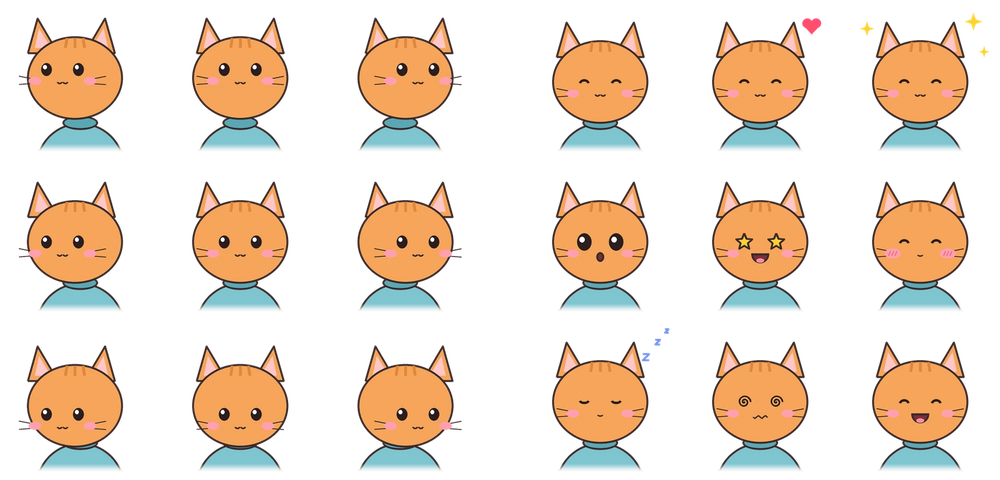
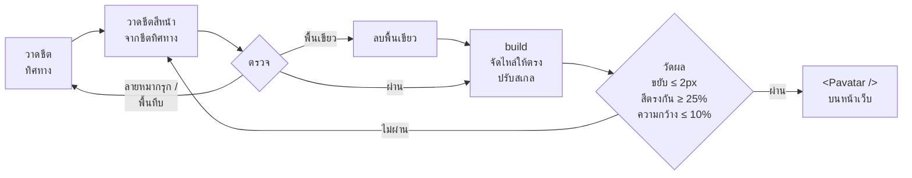

<div align="center">


# pretty-avatar

**อวตาร์ที่มองกลับมาหาคุณ**<br>
React component ขนาดเล็กที่หันหัวมองตามเคอร์เซอร์และมีปฏิกิริยาเมื่อถูกจิ้ม<br>
พร้อม skill สำหรับ AI agent `/pretty-avatar` ที่วาดตัวละครใหม่ให้คุณ

[](https://www.npmjs.com/package/pretty-avatar)
[](https://github.com/kimookpong/pretty-avatar/actions/workflows/ci.yml)
[](https://www.npmjs.com/package/pretty-avatar)
[](LICENSE)

[**ดูตัวอย่างจริง**](https://kimookpong.github.io/pretty-avatar/) · [เริ่มต้นใช้งาน](#เริ่มต้นใช้งาน) · [Props](#props) · [วาดตัวละครเอง](#วาดตัวละครเอง) · [English](README.md)

</div>

---

## เริ่มต้นใช้งาน

**1 —** ติดตั้ง

```bash
npm i pretty-avatar
```

**2 —** ดาวน์โหลดชีตสองไฟล์ของตัวละครจาก[หน้าตัวอย่าง](https://kimookpong.github.io/pretty-avatar/#cast) ไปไว้ที่ `public/avatars/`

```
public/avatars/mochi-directions.webp
public/avatars/mochi-reactions.webp
```

**3 —** แสดงผล

```tsx
import { Pavatar } from 'pretty-avatar'

export function Header() {
  return <Pavatar name="mochi" />
}
```

แค่นี้เลย ใช้ได้กับ Vite, Next.js (รวม App Router เพราะประกาศ `'use client'` ไว้แล้ว), Remix,
Astro islands และทุกที่ที่ใช้ React 18 ขึ้นไป

## สองทางในการได้ตัวละคร

| | **สำเร็จรูป** | **ให้ agent วาดให้** |
| --- | --- | --- |
| ได้อะไร | หนึ่งในหกตัวบนหน้าตัวอย่าง | อะไรก็ได้ที่คุณบรรยาย หรือตัวคุณเองจากรูปถ่าย |
| ทำอย่างไร | ดาวน์โหลดไฟล์ `.webp` สองไฟล์ | สั่ง agent ว่า `/pretty-avatar สุนัขชิบะใส่ผ้าพันคอสีแดง` |
| ต้องมี | ไม่ต้องมีอะไร | agent พร้อมเครื่องมือสร้างภาพ หรือ `OPENAI_API_KEY` |
| ใช้เวลา | ไม่กี่วินาที | ไม่กี่นาที รวมการวาดใหม่ |

## Props

```tsx
<Pavatar
  name="mochi"            // หรือ directions="…" reactions="…"
  basePath="/avatars"     // โฟลเดอร์ที่ name จะไปหาชีต
  size={140}              // ขนาด px (สี่เหลี่ยมจัตุรัส)
  label="avatar"          // ชื่อที่โปรแกรมอ่านหน้าจอใช้เรียก
  tracking                // หันตามเคอร์เซอร์
  deadZone={70}           // รัศมี px รอบกึ่งกลางที่จะมองตรง
  interactive             // มีปฏิกิริยาเมื่อคลิก; false จะแสดงเป็นรูปเฉย ๆ
  sleepAfter={20000}      // มิลลิวินาทีที่นิ่งก่อนจะหลับ, 0 = ไม่หลับ
  onBoop={(reaction) => {}}
/>
```

ทุก prop ไม่บังคับ ยกเว้นชีต: ใส่ `name` หรือใส่ทั้ง `directions` และ `reactions`
(เป็น path หรือรูปที่ import มา) ถ้าใส่ไม่ครบ TypeScript จะแจ้ง error

### เมื่อถูกจิ้ม

| ถ้าคุณ… | มันจะ… |
| --- | --- |
| คลิก | กะพริบตา แล้วแสดง `heart` → `sparkle` → `starstruck` → `grin` → `bashful` สลับกันไป |
| คลิกรัว ๆ สี่ครั้ง | มึนหัว (`dizzy`) |
| ปล่อยไว้เฉย ๆ | หลับ (`sleepy`) และตื่นเมื่อเมาส์ขยับ |
| ใช้จอสัมผัส | อยู่นิ่ง ๆ และมีปฏิกิริยาเมื่อแตะ |
| ตั้งค่าลดการเคลื่อนไหว | ข้ามแอนิเมชันเด้ง |

## วาดตัวละครเอง

ติดตั้ง skill ให้ coding agent ทุกตัวในเครื่องด้วยคำสั่งเดียว:

```bash
npx skills add kimookpong/pretty-avatar --skill pretty-avatar --agent '*' --global --yes
```

> CLI [skills](https://github.com/vercel-labs/skills) รองรับ agent ราว 80 ตัว ทั้ง Claude Code,
> Codex, Windsurf, Cline, Roo Code, Kiro, Qwen Code, Goose, Amp, Continue และอื่น ๆ
> ใช้ `--agent claude-code codex` เพื่อเลือกเฉพาะบางตัว หรือไม่ใส่ `--global` เพื่อติดตั้งเฉพาะโปรเจกต์เดียว

แล้วสั่งได้เลย:

```
/pretty-avatar ใส่ mochi ไว้บนหน้าแรก
/pretty-avatar สุนัขชิบะสีส้มใส่ผ้าพันคอสีแดง
/pretty-avatar วาดให้เหมือนฉัน        📎 photo.jpg
/pretty-avatar นกฮูกสีน้ำตาล สไตล์ pastel
```

agent ที่มีเครื่องมือสร้างภาพในตัวจะใช้ของตัวเอง ส่วน agent อื่นจะวาดผ่าน OpenAI Images API:

```bash
export OPENAI_API_KEY=sk-...
pip install pillow numpy scipy openai
```

สไตล์ที่มี: `colour` · `pastel` · `ink` · `watercolour` · `pixel` · `clay`

ไม่มี agent? นำ [prompt](skills/pretty-avatar/reference/prompts.md) ไปวางในแอปแชตใดก็ได้
หรือใช้ `npx skills use kimookpong/pretty-avatar@pretty-avatar` เพื่อพิมพ์ทั้ง skill ออกมาเป็น prompt เดียว

## เบื้องหลัง



ตัวละครหนึ่งตัวคือ sprite sheet ขนาด 3×3 สองแผ่น มุมจากอวตาร์ไปยังเคอร์เซอร์จะเลือกหนึ่งในเก้าช่อง
ของชีตซ้าย เมื่อคลิกจะแสดงช่องจากชีตขวา component เปลี่ยนแค่ `background-position`
ไม่มี canvas ไม่มีไลบรารีแอนิเมชัน ไม่มี JavaScript ทำงานทุกเฟรม มี dead zone และ hysteresis
เล็กน้อยกันหัวกระพริบเมื่อเคอร์เซอร์อยู่ตรงรอยต่อ

โมเดลสร้างภาพไม่เคยวาดสองชีตออกมาเหมือนกัน ตัวละครใหม่จึงผ่าน pipeline ที่วัดสิ่งที่ปกติคุณจะเห็นก็ต่อเมื่อขึ้นหน้าเว็บแล้ว:



[troubleshooting.md](skills/pretty-avatar/reference/troubleshooting.md) อธิบายแต่ละการตรวจและวิธีแก้เมื่อไม่ผ่าน

## คำถามที่พบบ่อย

**ใช้กับ server rendering ได้ไหม?** ได้ ไม่มีการแตะ `window` จนกว่าจะ mount และ render markup เดียวกันบน server

**ใช้ภาพวาดของตัวเองได้ไหม?** ได้ ชีต 3×3 สองแผ่นที่เรียง[ตามลำดับช่อง](skills/pretty-avatar/reference/prompts.md)
ใช้ได้ทั้งหมด รัน `python3 skills/pretty-avatar/scripts/avatar.py <name> --skip-generate` เพื่อจัดเรียงและตรวจ

**ใช้กับ Vue หรือ Svelte ได้ไหม?** ยังไม่ได้ ตัวชีตใช้ได้กับทุก framework แต่ component เป็น React

**คัดลอกไฟล์เดียวแทนการติดตั้งได้ไหม?** ได้
[`skills/pretty-avatar/Pavatar.tsx`](skills/pretty-avatar/Pavatar.tsx) คือ component ทั้งหมดในไฟล์เดียว

## ร่วมพัฒนา

```bash
npm install
npm run dev            # เว็บตัวอย่างที่ localhost:5173
npm test               # ทดสอบ component (vitest)
npm run test:pipeline  # ทดสอบ pipeline (python: pillow, numpy, scipy)
npm run samples        # วาดตัวละครตัวอย่างใหม่ลง public/avatars
```

เว็บตัวอย่าง deploy ขึ้น GitHub Pages ทุกครั้งที่ push เข้า `main`

## สัญญาอนุญาต

MIT © kimookpong — ได้แรงบันดาลใจจาก [page-mascot](https://github.com/nilbuild/page-mascot)
